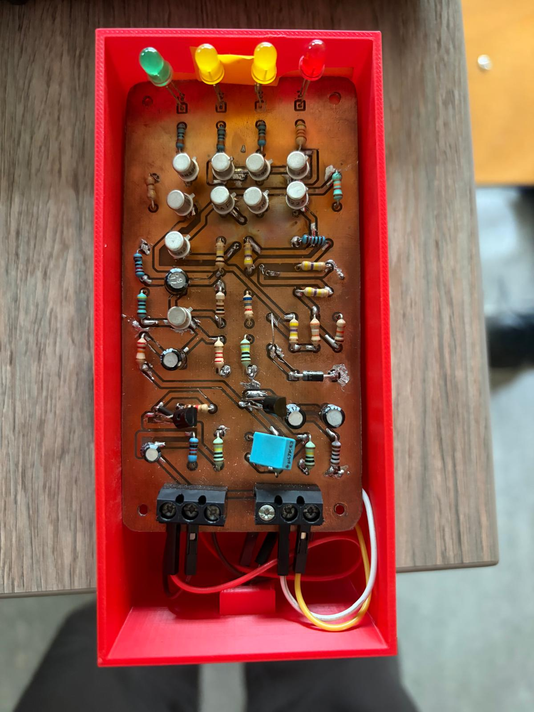
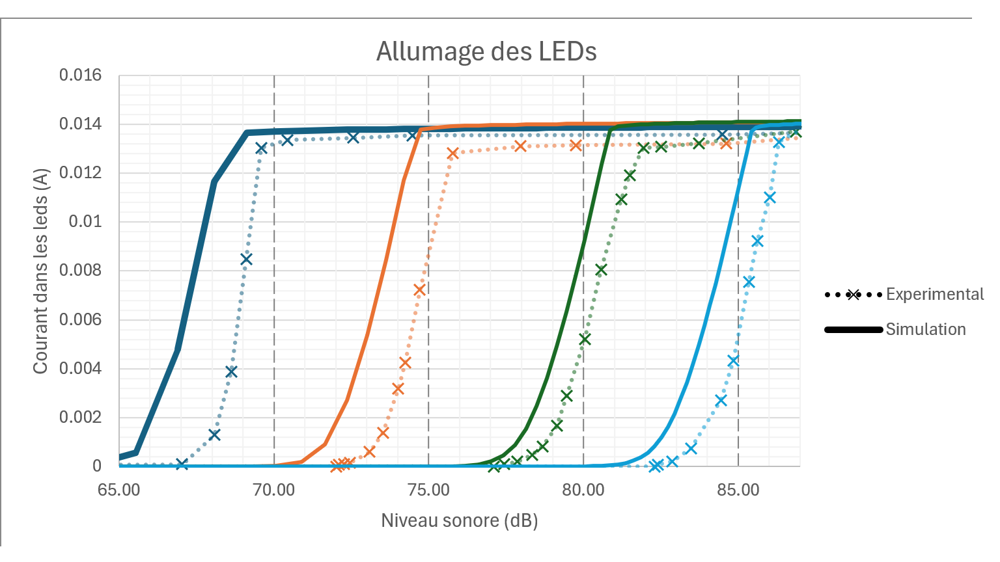

# Sound-Level-Meter
A collaborative start to finish design of a sound level meter: Circuit Design, Simulation (LTSpice), PCB (KiCad)


---
**Features**

- Measures sound pressure level (70–85 dB SPL)
- 5 dB resolution
- LED indication of sound level
- Analog signal conditioning using JFET/BJT circuitry
- Designed and simulated in LTSpice
- Custom PCB designed in KiCad and printed

**Overview**

The goal of this project was to design a sound level meter (sonomètre) under the following component constraints:
- EM100T
- JFET and bipolar transistors, and diodes
- Resistors
- LEDs
- 9 V Power supply

The project followed a complete hardware development workflow:

1. Circuit design
2. LTSpice simulation
3. Breadboard prototyping
4. Calibration
5. PCB design in KiCad
6. Assembly and testing

**Key Concepts**

- Simulations: Modelling and simulating circuit (LTSpice) to test viability of initial design concept
- Measure of Sound Level: Peak/Envelope Detection, Calculation of of level (dB SPL)
- Calibration: Selection of physical components to reach desired output for known source
- Physical Conception: PCB design (KiCad) and printing
- Presentation of Results: Functional diagrams, graphs and simulation captures

---

## PCB

<div align="center">



**PCB — Physical Board**

</div>


<div align="center">


**PCB — Component sides**

</div>

<div align="center">


**PCB — Reverse**

</div>

---

# Result

<div align="center">



**LED dB Threshold**
</div>
---

# Project Structure

```bash
Sound-Level-Meter/
├── README.md
├── doc/
│   ├── Final_Report.pdf
│   ├── Components_List.xlsx
│   ├── oral-presentation.pptx
│   └── images/
│       ├── Schematic.png
│       ├── Sonometre1.png
│       ├── Sonometre2.png
│       ├── Sonometre_PCB.jpeg
│       └── final_result.png
├── LTSpice/
│   └── sound_level_meter.asc
└── kicad/
    ├── sound_level_meter.kicad_pro
    ├── sound_level_meter.kicad_sch
    └── sound_level_meter.kicad_pcb
```
---
## My Contribrution
In this project my primary responsibilities included:
- Signal Conditioning (Amplification, Impedance Adaptation, Villard Circuit)
  - Analogue circuit design
  - LTSpice simulation
- Universal circuit
  - Breadboard prototype
  - Testing and calibration
  
## Contributors
- Gavin Mac Aonghusa
- Titouan Bocquet
- Bosco de Rauglaudre
