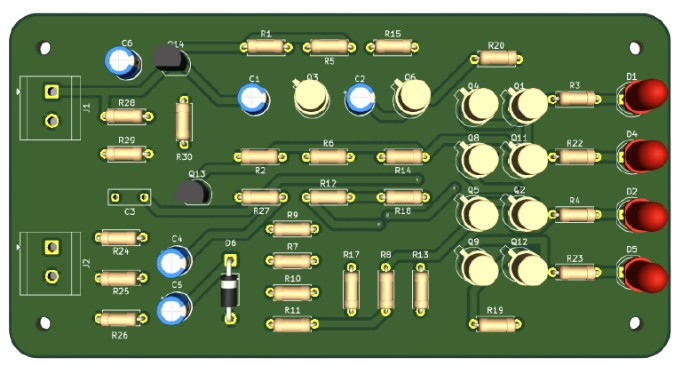
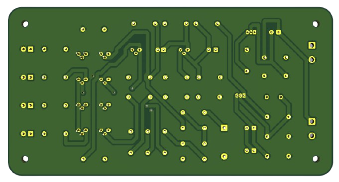

# Sound-Level-Meter
A collaborative start to finish design of a sound level meter: Circuit Design, Simulation (LTSpice), PCB (KiCad)

**Overview**
The goal of this project was to design a sound level meter (sonomètre) under the following component constraints:
- EM100T
- JFET and bipolar transistors, and diodes
- Resistors
- LEDs
- 9 V Power supply

To complete this project a theoretical circuit was conceptualised, LTSpice was used to simulate, test and adapt the circuit. A prototype was then developed using a breadboard and lab bench. The final PCB design was then created on KiCad and printed for final testing and results.

**Key Concepts**
- Simulations: Modelling and simulating circuit (LTSpice) to test viability of initial design concept
- Measure of Sound Level: Peak/Envelope Detection, Calculation of of level (dB SPL)
- Calibration: Selection of physical components to reach desired output for known source
- Physical Conception: PCB design (KiCad) and printing
- Presentation of Results: Functional diagrams, graphs and simulation captures

---

## PCB

**PCB — Component sides**

**PCB — Reverse**

**PCB — Physical Board**

---
